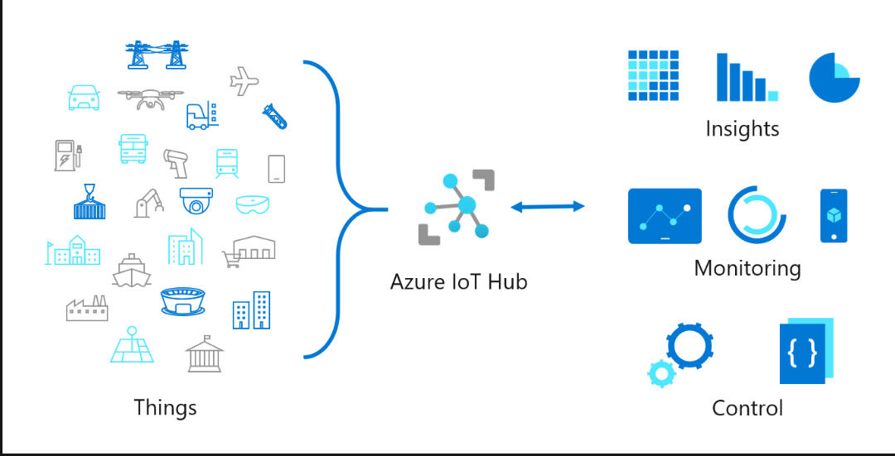

1. Suppose you work for manufacturing company. You're responsible for managing the authenticity of data from different kinds of sensors. All the devices are connected to IoT Hub. In this scenario, IoT Hub is suitable because:
    - IoT Hub provides per device identity.
      IoT Hub contains an identity registry that stores information about the devices and modules permitted to connect to the IoT Hub.

2. Suppose you're managing a number of IoT devices in a building. You need to manage the lifecycle of these devices at scale. IoT Hub is suitable for this scenario because:
    - IoT hub provides the ability to provision devices at scale without hardcoding IoT Hub connection information at the factory.
  
3. oT Hub-based application performs distributed processing. Which tier of IoT Hub should you use?
   - Standard tier
   The standard tier is used for advanced processing requirements such as distributed processing.

   

## What is IOT hub ?
 - Telemetry 
 - Provisioning
 - Routing
 - Scaling
 - Service availblity 

### IOT hub enables: 
  - secure your communication
  - Scale your solution 
  - Azure IOT hub
  - Data throughput
  - Route device data
  - Send command to devices
  - Monitor your IOT solution health
  - Integrate with other services
  - Manage and configure your devices
  - Create highly availble and resilient solutions
  - Connect virtually any devices